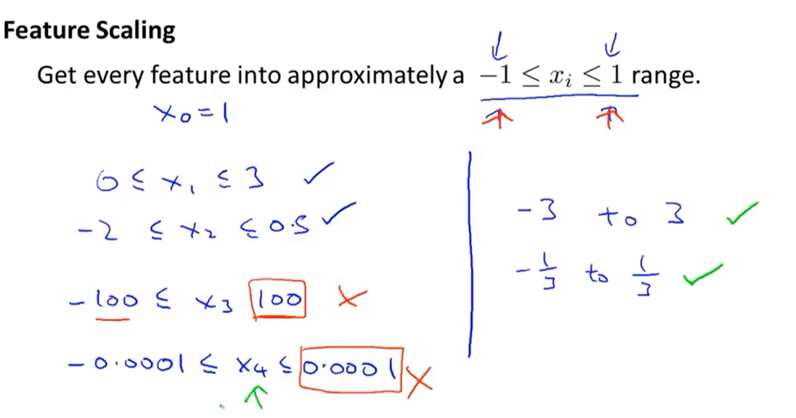
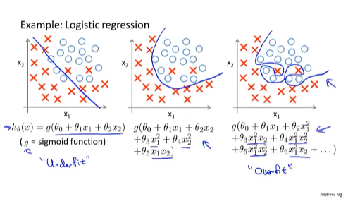

## 1.1 welcome to the study of Machine Learning

## 1.2 What is Machine Learning

the two major types of ml alogrithms:

## 1.3 What is Supervised Learning

predict the sort of continuous values attribute

predict real_valued output

classification problem:

## 1.4 What is Unsupervised Learning?

clustering

just give the datas, let the algorithm automatically do something

## 2.1 Linear Regression with one variable——Model Representation

## 2.2 Linear Regression with one variable——Cost Function

square error cost function

## 2.3 Cost Function Intuition Ⅰ

## 2.4 Cost Function Intuition Ⅱ

contour plots

the same bowel shape as J(theta1)

## 2.5 Gradient descent

## 2.6 Gradient descent intuition

## 2.7 Gradient descent for linear regression

Gradient descent will scale better to larger data sets than that normal equations method

## 3.1 Matrices and vectors

 

## 3.2 Addition and scalar multiplication

## 3.3 Matrix-vector multiplication

## 3.4 Matrix-matrix multiplication 

## 3.5 Matrix multiplication properties

## 3.6 Inverse and transpose

## 4.1 Linear Regression with multiple variables——Multiple features

## 4.2 Linear Regression with multiple variables——Gradient d6escent for multiple variables

## 4.3 Linear Regression with multiple variables——Gradient descent in practice Ⅰ: Feature Scaling

gradient descents can converge more quickly

## 4.4 Linear Regression with multiple variables——Gradient descent in practice Ⅱ: Learning rate

the author tends to look at plots like the figure on the left rather than rely on an automatic convergence test

 

## 4.5 Linear Regression with multiple variables——Features and polynomial regression

sometimes by defining new features you might actually get a better model

## 4.6 Linear Regression with multiple variables——Normal equation

if you are using this normal equation method, then feature scaling isn't actually necessary

 

For this specific model of linear regression, the normal equation can give you an alternative that can be much faster than gradient descent. So, depending on the detail of your algorithm, depending on the detail of the problem and how many features that you have, both of these algorithms are well worth knowing about.

## 4.7 Linear Regression with multiple variables——Normal equation and non-invertibility (optional)

non-invertibility happens pretty rarely anyway so this should not be a problem for most implementations of linear regression

## 4.8 Octave Tutorial——Working on and submitting programming exercises

## 5.1 Octave Tutorial——Basic operations

## 5.9 Octave Tutorial——Vectorization

## 6.1 Logistic Regression——Classification

## 6.2 Logistic Regression——Hypothesis Representation

the term logistic function, that's what gives rise to the name logistic regression

## 6.3 Logistic Regression——Decision boundary

this decision boundary and a region where we predict Y equals 1 versus Y equals 0 are properties of the hypothesis and of the parameters of the hypothesis and not properties of the data set

the training set is not what we use to define the decision boundary but to fit the parameters theta

## 6.4 Logistic Regression——Cost function

if we use the same form of cost function as the Linear Regression's, we'll get a non-convex function, to which the gradient descent is not useful

## 6.5 Logistic Regression——Simplified cost function and gradient descent

## 6.6 Logistic Regression——Advanced optimization

it is actually entirely possible to use these algorithms successfully and apply to lots of different learning problems without actually understanding the inner-loop of what these algorithms do

## 6.7 Logistic Regression——Multi-class classification: One-vs-all

"one vs all" is also called "one vs rest"

## 7.1 Regularization——The problem of overfitting

underfitting, high bias

overfitting, high variance

## 7.2 Regularization——Cost function

if theta3 or theta4 are big nummbers, the value of the cost function will be big as well because there are plus 1000theta3 and 1000theta4, therefore, to decrease the value of the cost function, the value of theta3 and theta4 should be small, then the second hypothesis will change itself to a quadratic function

## 7.3 Regularization——Regularized linear regression

First situation: regularization used in gradient descent

Second situation: regularization used in Normal equation

## 7.4 Regularization——Regularized logistic regression

