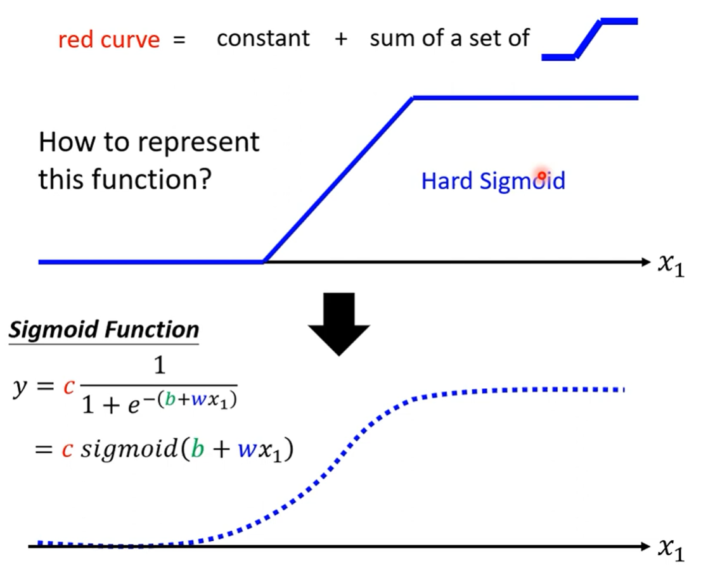
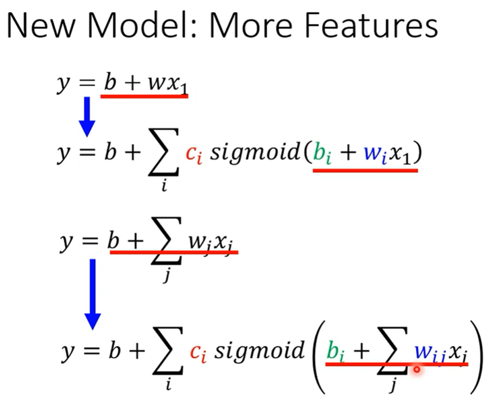

# 认识机器学习

Machine Learing ≈ Looking for Function

深度学习是机器学习的一个关键技术

深度学习是要找一个类神经网络的函数 Neural Network

函数的输入有向量、矩阵、序列

函数的输出有数值、类别、文本、图片

如何教机器？

监督学习：收集数据，进行标记（收集数据和标记很耗费人工）

自监督学习：先训练好基本功Pre-train（Pre-trained model也叫fundation model），此时使用的是没标注的数据（具体怎么学习后续再讲）。通过pre-train的学习，可以在downstream tasks中发挥出效果，这是自监督学习神奇的地方。

生成式对抗网络 generative adversarial network：自动将收集到的两部分数据关联起来。

reinforcement learning强化学习：当我们不知道怎么标注的时候

进阶课题：不只是追求正确率

Anomaly Detection 异常检测：机器能够回答“我不知道”

Explainable AI 可解释性AI：不仅知道，还能解释为什么（这里老师用了宝可梦和数码宝贝的例子，结果由于图片格式弄错（png的图片读取之后背景都是黑的），并没有正确分辨，hh）

Model Attack 模型攻击

Domain Adaptation 域适应：当训练数据和测试数据的分布差距很大时，正确率会暴跌

Network Compression 网络压缩：将模型变小，大模型可能过于大以至于不能操作

Life-long Learning 终生学习

Meta Learing = Learn to learn 元学习：学习如何学习，不再使用人为的算法，从过去的学习经验发明出新的算法。和Few-shot learning（使用很少的数据就能学会）关系紧密。

## 视频第二节

orientation：

1. 关注深度学习
2. 包含最新的技术

Grading Criterion

对提供的范例程序进行相关修改

### Kaggle

# 机器学习基本概念

Machine Learing ≈ Looking for Function 让机器具备找函数的能力

regression

classification

sructured learning

这一节是以Linear model为例讲的

### 机器怎么找一个函数？

常说的模型model就是带有未知参数的一个function

为什么这里的L是红色这里大，蓝色这里小（弹幕说在圆心处是最小的，为什么）

error surface

损失函数的输入就是b和w，它的输出就是表示这组参数是不是好的

label就是正确的数值

自己设定的值就是hyperparameter，比如这里的学习率，我们把它设置的大一些，那么每次的变化就大

### 总结：

下面三个步骤合起来叫做训练：

1. 写出一个函数，其中带有未知数
2. 定义损失函数
3. 最优解，使得Loss最小

通常对模型的修改，来自于你对问题的理解，也就是domain knowledge

## P4

来自模型的限制，称为model bias（和b是两个概念，只是叫法一样）

这里的概念以前学过。只要有足够多的

我们就能组合出来

现在的问题就是怎么把整个蓝色折线表示出来？——使用sigmoid

转化成矩阵和向量的表示：

每次更新参数叫update，所有的batch都走一遍，叫epoch（为什么要分batch，后面会细讲）

learning rate、几个sigmoid函数、batch size都是超参数

激活函数

为什么不直接把network变胖，而是要变深呢？（后面会细讲）

过拟合 overfitting

怎么解决过拟合？

更多的数据 Data augmentation：图像左右翻转，图像截取一部分

不要让模型太flexible （比如CNN就是比较没有弹性的）

mismatch

原因：数据背后的分布不同
